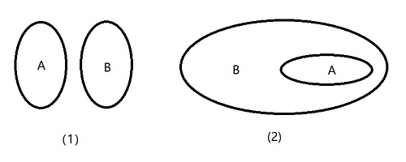

# 1.1 集合及其运算

## 1.1.1 集合的概念

> 参考： [集合概念_百度百科](https://baike.baidu.com/item/%E9%9B%86%E5%90%88%E6%A6%82%E5%BF%B5/6341172)

### 集合概念关键字

**对象**：可以感觉到的客观存在以及思想中的事物或抽象符号，都可以称作对象。

**集合**：把一些能够确定的不同的对象看成一个整体，就说这个整体是由这些对象的全体构成的集合。

**元素**：集合中每个对象叫做这个集合的元素。

集合有时也简称为 **集**。
含有有限个元素的集合叫做 **有限集**，含有无限个元素的集合叫做 **无限集**。

### 集合中元素的特性

1. **确定性**：作为集合的元素，必须是能够确定的。
2. **互异性**：集合中的元素一定是不同的。
3. **无序性**：集合中的元素没有固定的顺序。

### 集合符号

$\Large \in$ ：属于；

$\Large \notin$ ：不属于；

$\Large N$ ：由全体非负整数构成的集合，叫做 **自然数集** 或 **非负正数集**；

$\Large N_+$ 或 $\Large N^*$ ：*非负整数集* 内排除 0 的集合，叫做 **正整数集**；

$\Large Z$ ：由全体整数构成的集合，叫做 **整数集**；

$\Large Q$ ：由全体 [有理数](https://baike.baidu.com/item/%E6%9C%89%E7%90%86%E6%95%B0/105546) 构成的集合，叫做
[**有理数集**](https://baike.baidu.com/item/%E6%9C%89%E7%90%86%E6%95%B0%E9%9B%86) ；

$\Large R$ ：由全体 [实数](https://baike.baidu.com/item/%E5%AE%9E%E6%95%B0/296419) 构成的集合，叫做
[**实数集**](https://baike.baidu.com/item/%E5%AE%9E%E6%95%B0%E9%9B%86) ；

## 1.1.2 集合的表示方法

### 列举法

当集合元素不多时，可以直接将元素列举出来，并写在花括号（ $\{\}$ ）内，这种表示集合的方法叫做 **列举法**：

$$
\Huge
\{1, 2, 3, 4, 5, 6\}
$$

### 性质描述法

$$
\Huge
A = \{x∈I | p(x)\}
$$

在上式中，竖线（ $|$ ）左边表示集合 $A$ 中的任意一个元素，并标出元素的取值范围，
竖线（ $|$ ）右边表示只有集合 $A$ 内的元素才具有的 **特征性质** 。

在某种约定下，$x$ 的取值合集可省略不写，例如上式可简写为 $\Large A = {x | p(x)}$ 。

## 1.1.3 集合之间的关系

### 集合关系符号

$\Large \subseteq$ ：包含于；

$\Large \supseteq$ ：包含；

$\Large \varnothing$ ：空集；

$\Large \subsetneqq$ ：真包含于；

$\Large \supsetneqq$ ：真包含；

### 子集

如果集合 $A$ 的任意一个元素都是集合 $B$ 的元素，那么集合 $A$ 叫做集合 $B$ 的 **子集**，记作：

$$
\Huge
A \subseteq B 或 A \supseteq B
$$

读作“$A$ 包含于 $B$” 或 “$B$ 包含 $A$”。

### 空集

不含任何元素的集合叫做 **空集**，记作 $\Large \varnothing$。

*空集* 是任意一集合的子集。

### 真子集

如果集合 $A$ 是集合 $B$ 的子集，并且 $B$ 中至少有一个元素不属于 $A$，那么集合 $A$ 叫做 集合 $B$ 的 **真子集**，记作：

$$
\Huge
A \subsetneqq B 或 B \supsetneqq A
$$

读作“$A$ 真包含于 $B$”或“$B$ 真包含 $A$”。

> 真子集与子集的区别：
> - 子集就是一个集合中的全部元素是另一个集合中的元素，**有可能** 与另一个集合相等；
> - 真子集就是一个集合中的元素全部是另一个集合中的元素，**但不存在** 相等；

### 维恩图（Venn diagram）

> 参考 [维恩图_百度百科](https://baike.baidu.com/item/%E7%BB%B4%E6%81%A9%E5%9B%BE/9416531)

通常使用平面上一个封闭曲线的内部表示一个集合，如上图（1）。

如果集合 $A$ 是集合 $B$ 的 *真子集*，那么把表示 $A$ 的区域画在表示 $B$ 的区域内部，如上图（2）。

### 集合相等

如果两个集合的 *元素* 完全相同，那么就可以说这两个 **集合相等**。

集合 $A$ 等于集合 $B$，记作：

$$
\Huge
A = B
$$

由相等的定义，可得：

如果 $A \subseteq B$ 且 $B \subseteq A$，那么 $A = B$；
反之，如果 $A = B$，那么 $A \subseteq B$ 且 $B \subseteq A$；

## 1.1.4 集合的运算

### 交集

给定两个集合 $A$、$B$，由既属于 $A$ 又属于 $B$ 的所有公共元素所构成的集合，叫做 $A$、$B$ 的 **交集**，记作：

$$
\Huge
A \cap B
$$

读作“$A$ 交 $B$”

### 并集

给定两个集合 $A$、$B$，把它们所有的元素合并在一起构成的集合，叫做 $A$ 与 $B$ 的 **并集**，记作：

$$
\Huge
A \cup B
$$

读作“$A$ 并 $B$”

### 全集与补集

在研究集合与集合之间的关系时，如果一些集合都是某一给定集合的子集，那么称这个给定的集合为这些集合的 **全集**，通常用 $U$ 表示。

如果 $A$ 是全集 $U$ 的一个 *子集*，由 $U$ 中的所有不属于 $A$ 的元素构成的集合，叫做 $A$ 在 $U$ 中的 **补集**，记作：

$$
\Huge
\complement _ U A
$$

读作“$A$ 在 $B$ 中的补集”。
